# AutoPilot AI — Technical Architecture Blueprint

> **Enterprise Multi-Agent Business Automation Platform**
> Architecture document — **approved with modifications (v2.0).** Implementation begins at M1.

| | |
|---|---|
| **Document status** | Approved v2.0 — incorporates the 15 stakeholder modifications |
| **Author role** | Senior Software Architect / Staff Full-Stack AI Engineer |
| **Target** | Production deployment for an enterprise client |
| **Last updated** | 2026-07-11 |

### What changed in v2.0 (stakeholder modifications)

| # | Modification | Where addressed |
|---|---|---|
| 1 | Keep full scope (no trims) | §1, §33 roadmap |
| 2 | Every integration pluggable (10 provider interfaces) | §5 Provider Abstraction |
| 3 | Plugin discovery via registry/factory | §6 Plugin Discovery |
| 4 | MCP support (clients/servers/tools) | §8 MCP Integration |
| 5 | Full AI observability record | §10 schema, §22 |
| 6 | Workflow versioning + lifecycle | §20 |
| 7 | Six agent memory levels | §16 |
| 8 | Event bus / event-driven agents | §7 |
| 9 | AI Tool Marketplace (tool metadata) | §19 |
| 10 | Full RAG pipeline (OCR→…→memory) | §17 |
| 11 | Prompt management (versioning/testing/eval) | §18 |
| 12 | Cost dashboard (multi-provider ready) | §22 |
| 13 | Export diagrams (PNG/SVG/Mermaid) | §23, Appendix B |
| 14 | Eight sequence diagrams | §23 |
| 15 | Full documentation set (9 guides) | §31 |

---

## Table of Contents

**Foundations** — [0. Principles](#0-guiding-architectural-principles) · [1. Functional Requirements](#1-functional-requirements) · [2. Non-Functional Requirements](#2-non-functional-requirements)

**System design** — [3. High-Level Architecture](#3-high-level-system-architecture) · [4. Low-Level Design](#4-low-level-design)

**Extensibility platform** — [5. Provider Abstraction Layer](#5-provider-abstraction-layer) · [6. Plugin Discovery & Registry](#6-plugin-discovery--registry) · [7. Event-Driven Architecture](#7-event-driven-architecture-event-bus) · [8. MCP Integration Layer](#8-mcp-integration-layer)

**Structure & data** — [9. Folder Structure](#9-complete-folder-structure) · [10. Database Schema](#10-database-schema-er-diagram) · [11. API Design](#11-api-design) · [12. Auth & Authorization](#12-authentication--authorization-flow)

**AI core** — [13. LangGraph State](#13-langgraph-state-diagram) · [14. Multi-Agent Architecture](#14-multi-agent-architecture) · [15. Agent Communication](#15-agent-communication-flow) · [16. Memory Architecture](#16-memory-architecture-six-levels) · [17. RAG Pipeline](#17-rag-architecture-full-pipeline) · [18. Prompt Management](#18-prompt-management) · [19. Tool Marketplace](#19-ai-tool-marketplace)

**Workflows & observability** — [20. Workflow Versioning & Lifecycle](#20-workflow-versioning--lifecycle) · [21. Workflow Execution Flow](#21-workflow-execution-flow) · [22. AI Observability & Cost](#22-ai-observability--cost-dashboard)

**Diagrams** — [23. Sequence Diagrams](#23-sequence-diagrams) · [24. Component Diagrams](#24-component-diagrams)

**Ops & quality** — [25. Deployment](#25-deployment-architecture) · [26. Docker](#26-docker-architecture) · [27. Security](#27-security-design) · [28. Logging & Monitoring](#28-logging--monitoring-strategy) · [29. Error Handling](#29-error-handling-strategy) · [30. Testing](#30-testing-strategy) · [31. Documentation Plan](#31-documentation-plan) · [32. Future Scalability](#32-future-scalability-plan) · [33. Roadmap](#33-development-roadmap-milestones)

**Appendices** — [A. Tech Ledger](#appendix-a--technology-decisions-ledger) · [B. Diagram Export](#appendix-b--diagram-export-strategy)

---

## 0. Guiding Architectural Principles

Every decision below is justified against these principles — the contract for the codebase.

- **Clean Architecture** — dependencies point inward. Domain and use-cases never import framework code. FastAPI, SQLAlchemy, ChromaDB, Ollama, MCP servers are *details* behind interfaces.
- **SOLID** — especially Dependency Inversion: nothing in business logic depends on a concrete implementation; it depends on an interface resolved at runtime.
- **Open/Closed via plugins** — the system is *extended* by adding plugins (agents, tools, providers, workflows, integrations), never by modifying existing code. New plugin = new file + auto-registration.
- **Event-driven decoupling** — components react to domain events on a bus rather than calling each other directly.
- **DRY / KISS / YAGNI** — one canonical implementation per concern; simplest thing that works; no speculative complexity beyond the approved feature set.
- **Config over code** — everything environment-specific flows from typed settings backed by `.env`.
- **Everything observable** — every AI execution is fully recorded (prompt, version, model, tokens, cost, timing, retrieval, tool calls, errors).
- **Human-in-the-loop by default** for any outbound or irreversible action.

### Load-bearing decisions

| Area | Decision | Rationale |
|---|---|---|
| External integrations | **10 provider interfaces** (LLM, Embedding, VectorStore, Database, Storage, OCR, Search, Email, Calendar, Notification) | Zero business logic couples to a vendor; swap by config/registry (§5). |
| Extensibility | **Registry + factory + entry-point auto-discovery** | New agents/tools/providers/workflows require no edits to existing code (§6). |
| Inter-component comms | **In-process async Event Bus** (Redis pub/sub as scale path) | Decoupled, future integrations subscribe without touching producers (§7). |
| Tool protocol | **MCP layer** (clients, servers, registry) unified with LangChain tools | Agents call MCP tools identically to native tools (§8, §19). |
| Orchestration | **LangGraph** supervisor + typed state + checkpointer | Cyclic multi-agent graphs, HITL `interrupt`, durable resume, versioned workflows (§13, §20). |
| LLM/embeddings | Default **Ollama**, fully abstracted | Free/local per spec; abstraction preserves swap to hosted providers. |
| RDBMS | **SQLite** (dev) → Postgres-ready via async SQLAlchemy 2.0 + Alembic | Spec requirement; migration is a config change. |
| Vector DB | **ChromaDB** behind `VectorStoreProvider` | Spec requirement; swappable to Qdrant/pgvector. |
| Frontend | Next.js 14 App Router, TS strict, Tailwind, shadcn/ui, TanStack Query + Zustand | Enterprise dashboard; server/UI state separation. |
| Realtime | **WebSocket** per run + event-bus fan-out | Live status, token streaming, approval prompts. |

---

## 1. Functional Requirements

**Full scope retained — no module trimmed.** Optional external integrations (Google Calendar, Tavily) ship as pluggable adapters with their interfaces present from day one; a default local/free adapter backs each so the platform runs end-to-end without paid keys.

Platform capabilities (cross-cutting): **FR-P** Provider abstraction, plugin discovery, event bus, MCP, prompt management, tool marketplace, workflow versioning, AI observability + cost tracking.

| Module | Key FRs (abbrev.) |
|---|---|
| **Auth & Users** | Register, login (access+refresh JWT), refresh rotation, logout, RBAC (ADMIN/USER), profile + preferences |
| **Dashboard** | Aggregated widgets (jobs, agents, memory, activity, analytics, notifications) via one endpoint + WS push |
| **Email Agent** | Ingest (IMAP/API) → intent classify (9 intents) → entity extract → knowledge+history retrieval → draft → **approval** → SMTP send → persist |
| **Document Intelligence** | Upload PDF/DOCX/TXT/CSV/XLSX → OCR→clean→metadata→chunk→embed→index; lifecycle status; batch |
| **RAG** | Semantic/similarity/hybrid + rerank + compression, metadata filter, cited answers, thread memory |
| **Research Agent** | Web search (DuckDuckGo default, Tavily adapter), Playwright fetch/extract, summarize/compare/report |
| **Task Planner** | Auto tasks: priority, deadline, checklist, dependencies; CRUD + status |
| **Calendar Agent** | Read/create events, suggest slots, agendas, follow-ups (local default, Google adapter) |
| **Memory** | Six levels (§16), retrieval semantic/keyword/hybrid |
| **Analytics** | Emails, docs, LLM usage/tokens, agent perf, response time, KB size, daily activity |
| **Notifications** | Telegram/SMTP/in-app; triggers: completed/failure/approval/indexed/daily-summary |
| **Human Approval** | Pause → show output → approve/reject/edit/retry, audited |
| **Workflow Builder** | Visual graph, live status, logs, retry, cancel; **versioning, history, rollback, clone** (§20) |
| **Logs / Observability** | Full per-execution AI record (§22) powering a monitoring dashboard |
| **Scheduler** | Daily/weekly/monthly/cron jobs via APScheduler |
| **Cost** | Token/provider/cost/latency/model-comparison dashboard (multi-provider ready) |
| **Prompts** | Versioning, templates, variables, registry, testing, evaluation (§18) |

---

## 2. Non-Functional Requirements

| Category | Requirement | Target / Approach |
|---|---|---|
| Performance | Non-LLM API p95 | < 300 ms (async I/O, indexed queries, caching) |
| | RAG query e2e | < 4 s p95 (local Ollama, reference HW) |
| Scalability | Horizontal | Stateless API; JWT; externalizable state; event bus → Redis path |
| Extensibility | Add capability w/o core edits | Plugin registries + provider interfaces (Open/Closed) |
| Availability | Graceful degradation | Provider failure → retry/backoff → structured error; app stays up |
| Reliability | Workflow durability | Checkpointer resume-after-failure; versioned workflows |
| Security | See §27 | argon2, JWT, RBAC, validation, secure uploads, secret hygiene, SSRF/prompt-injection controls |
| Maintainability | Clean/modular | Layered, feature-based, DIP seams; lint + type gates |
| Observability | Full AI trace + metrics | §22, §28; JSON logs, correlation IDs, `/health` `/metrics` |
| Testability | Coverage | Unit ≥80% services/agents; integration all routers; mock providers |
| Portability | One-command run | Docker Compose full stack |
| Accessibility | WCAG AA intent | Keyboard nav, dark mode, semantic HTML |
| Cost | Infra | Entirely free/open-source by default |
| Privacy | Data locality | Local inference + storage by default; per-user partitioning |

---

## 3. High-Level System Architecture

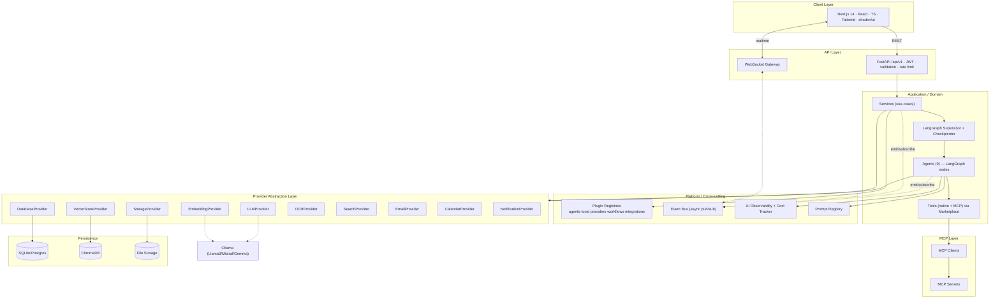

**Layering (inward-only dependencies):**
`API/WS → Services → Domain (entities, interfaces, agent/tool contracts) ← Infrastructure (providers, repos, MCP, event bus impls)`. The platform layer (registries, bus, observability, prompts) is cross-cutting and depends only on domain interfaces.

---

## 4. Low-Level Design

### 4.1 Backend layered breakdown (per feature module)

| Layer | File | Responsibility | Depends on |
|---|---|---|---|
| Router | `router.py` | HTTP only: parse, validate, call service, shape response (thin) | Schemas, Service (DI) |
| Schema | `schemas.py` | Pydantic DTOs | — |
| Service | `service.py` | Use-case logic, transactions, orchestration, emits events | Repos + providers (interfaces) |
| Repository | `repository.py` | Data access (implements repo interface) | ORM models |
| Model | `models.py` | SQLAlchemy entities | Base |
| Deps | `dependencies.py` | FastAPI DI wiring | Service, session |

### 4.2 Composition root & DIP seams

`core/container.py` is the single composition root. It builds concrete implementations (Ollama, Chroma, SMTP…) and binds them to interfaces, then exposes FastAPI `Depends` providers. Every seam listed in §5 is bound here. Swapping an implementation = changing one binding driven by an env var (e.g. `LLM_PROVIDER=ollama`). This is what makes agents unit-testable with mocks.

### 4.3 Agent contract

```python
class BaseAgent(ABC):
    name: ClassVar[str]
    description: ClassVar[str]
    def __init__(self, llm: LLMProvider, tools: ToolRegistry,
                 memory: MemoryManager, events: EventBus, prompts: PromptRegistry): ...
    @abstractmethod
    async def run(self, state: GraphState) -> GraphState: ...
```

Single responsibility, composable, dependency-injected, event-aware. Registered via `@register_agent` (auto-discovered, §6).

---

## 5. Provider Abstraction Layer

**No business logic depends on a concrete external system.** Each capability is a `Protocol` in `domain/interfaces/`, implemented under `infrastructure/`, and bound in the container. Selection is env-driven.

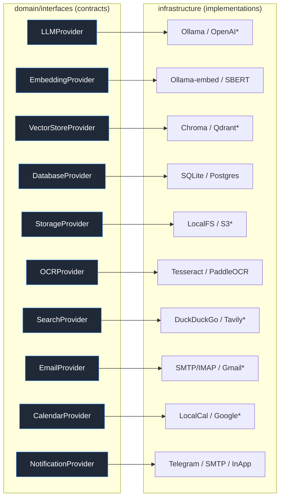
`*` = adapter present, activated by config/keys. Each provider interface declares a `ProviderMeta` (name, kind, version, capabilities, config schema, health-check) so it participates in discovery (§6) and health/observability.

| Interface | Core methods | Default impl |
|---|---|---|
| `LLMProvider` | `complete`, `stream`, `structured` | Ollama |
| `EmbeddingProvider` | `embed`, `embed_batch`, `dim` | Ollama `nomic-embed-text` |
| `VectorStoreProvider` | `upsert`, `query`, `delete`, `create_collection` | ChromaDB |
| `DatabaseProvider` | `session`, `health` | SQLite (async) |
| `StorageProvider` | `save`, `get`, `delete`, `url_for` | Local filesystem |
| `OCRProvider` | `extract_text`, `extract_layout` | Tesseract |
| `SearchProvider` | `search`, `fetch` | DuckDuckGo + Playwright |
| `EmailProvider` | `fetch_inbox`, `send` | SMTP/IMAP |
| `CalendarProvider` | `list_events`, `create_event`, `free_slots` | Local store |
| `NotificationProvider` | `notify` | Telegram / SMTP / in-app |

---

## 6. Plugin Discovery & Registry

**Open/Closed by construction:** capabilities are added by dropping a module that self-registers; no existing file changes.

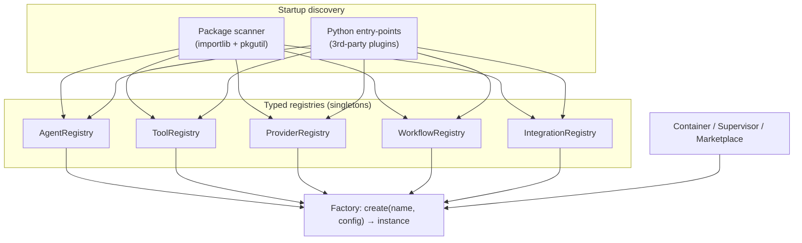

- **Decorators** register at import time: `@register_agent`, `@register_tool`, `@register_provider(kind=...)`, `@register_workflow`, `@register_integration`.
- **Scanner** imports all modules under `agents/`, `tools/`, `infrastructure/`, `workflows/`, `integrations/` on boot; **entry-points** allow external pip-installed plugins with zero core edits.
- **Factory** resolves a name → validates config against the plugin's declared schema → instantiates. Unknown/duplicate names fail fast with a clear error.
- Registries expose introspection endpoints (`GET /api/v1/registry/*`) powering the UI (Agents page, Tool Marketplace).

---

## 7. Event-Driven Architecture (Event Bus)

Agents and services communicate through **domain events**, not direct calls — producers don't know consumers.

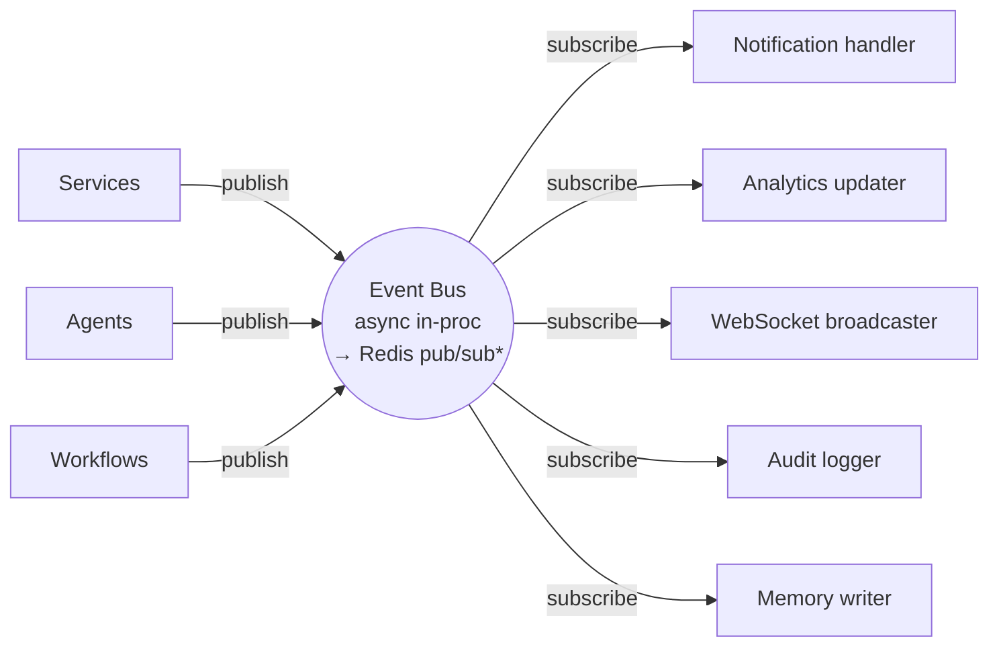

**Canonical event catalog** (`domain/events.py`, typed payloads):
`WorkflowStarted`, `WorkflowStepCompleted`, `DocumentUploaded`, `DocumentIndexed`, `ResearchCompleted`, `EmailDrafted`, `ApprovalRequired`, `ApprovalReceived`, `WorkflowCompleted`, `WorkflowFailed`, `NotificationRequested`, `MemoryWritten`, `CostRecorded`.

- **Contract:** `EventBus.publish(event)` / `EventBus.subscribe(EventType, handler)`. Default = async in-process dispatcher; scale path swaps in Redis pub/sub behind the same interface (§32).
- **Delivery:** handlers run isolated; a failing handler is logged and does not break the publisher (at-least-once, idempotent handlers).
- **Why:** new integrations (e.g. Slack notifier, CRM sync) subscribe to existing events — the producers never change.

---

## 8. MCP Integration Layer

Model Context Protocol is first-class: agents call MCP tools **identically** to native tools.

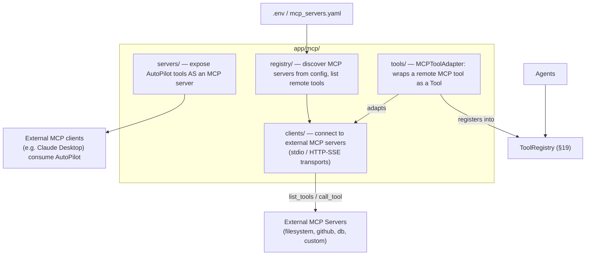

- **MCP clients** connect to configured external MCP servers (stdio or HTTP/SSE), enumerate remote tools, and expose them through `MCPToolAdapter`, which conforms to the same `Tool` contract used by native tools → registered in the `ToolRegistry`. Agents are agnostic to a tool's origin.
- **MCP servers** publish selected AutoPilot capabilities (RAG query, document search, task creation) so external MCP clients can consume the platform.
- **Registry** loads server definitions from config (`MCP_SERVERS`), handles lifecycle/health, and surfaces remote tools in the Tool Marketplace with an `origin=mcp` tag and permission gating.

---

## 9. Complete Folder Structure

```text
autopilot-ai/
├── docker-compose.yml            # + prod profile (nginx)
├── .env.example
├── README.md
├── docs/
│   ├── ARCHITECTURE.md
│   ├── guides/                   # §31: api, development, deployment, testing,
│   │                             #      agent-dev, plugin-dev, mcp-integration
│   └── diagrams/                 # §23/AppB: .mmd + exported .png/.svg
│
├── backend/
│   ├── pyproject.toml · Dockerfile · alembic.ini
│   ├── alembic/versions/
│   ├── tests/{unit,integration,agents}/ · conftest.py
│   └── app/
│       ├── main.py               # ASGI factory: settings→logging→discovery→routers→bus→scheduler
│       ├── core/                 # config, container, security, logging, exceptions, middleware
│       ├── domain/
│       │   ├── entities/
│       │   ├── interfaces/       # the 10 providers + repo + tool + memory + eventbus contracts
│       │   └── events.py         # event catalog (§7)
│       ├── platform/             # cross-cutting engines
│       │   ├── registry/         # agent/tool/provider/workflow/integration registries + scanner + factory
│       │   ├── events/           # EventBus impls (inproc, redis*)
│       │   ├── observability/    # AI trace recorder + cost tracker (§22)
│       │   └── prompts/          # PromptRegistry, template loader, evaluator (§18)
│       ├── infrastructure/       # provider implementations (§5)
│       │   ├── llm/ · embeddings/ · vectorstore/ · storage/ · ocr/
│       │   ├── search/ · email/ · calendar/ · notifications/ · database/
│       ├── mcp/                  # §8: clients/ servers/ registry/ tools/
│       ├── database/             # base, session, models base
│       ├── features/             # feature modules (router/service/repo/models/schemas/deps)
│       │   ├── auth/ · users/ · dashboard/ · documents/ · rag/ · emails/
│       │   ├── research/ · tasks/ · calendar/ · memory/ · analytics/
│       │   ├── notifications/ · approvals/ · workflows/ · scheduler/
│       │   ├── cost/ · prompts/ · registry/   # introspection API
│       ├── agents/               # base + supervisor + 8 agents (each: agent.py, prompts/, tools.py)
│       ├── workflows/            # state.py, graph.py, checkpointer.py, versioning.py, nodes/
│       ├── memory/               # MemoryManager facade + 6 stores (§16)
│       ├── rag/                  # loaders/ ocr/ cleaning/ metadata/ chunking/ embedding/
│       │                         #   retriever/ rerank/ compression/ citation/ pipeline.py
│       ├── tools/                # native tools + marketplace metadata (§19)
│       ├── api/v1/               # router aggregation
│       ├── ws/                   # websocket manager (event-bus fan-out)
│       ├── scheduler/            # APScheduler jobs
│       └── utils/
│
├── frontend/
│   ├── Dockerfile · package.json · tsconfig.json (strict) · tailwind.config.ts · eslint/prettier
│   └── src/
│       ├── app/(auth|dashboard)/…   # pages: dashboard, agents, knowledge-base, documents,
│       │                            #   workflow-builder, email-center, analytics, tasks,
│       │                            #   memory, approvals, notifications, cost, prompts,
│       │                            #   marketplace, settings, logs
│       ├── components/{ui,common,features}/
│       ├── features/*/               # api client + hooks + types per domain
│       ├── hooks/ · lib/{api,ws,auth} · stores/ · types/
│
├── documents/                    # uploaded files (bind mount)
├── vector_store/                 # ChromaDB persistence (bind mount)
├── mcp_servers.yaml              # external MCP server definitions
└── scripts/                      # seed, migrate, ollama-pull, export-diagrams
```

---

## 10. Database Schema (ER Diagram)

Adds v2.0 tables for **workflow versioning**, **prompt management**, **AI observability/cost**, and **tool registry snapshots**.

```mermaid
erDiagram
    USER ||--o{ REFRESH_TOKEN : has
    USER ||--o{ DOCUMENT : owns
    USER ||--o{ EMAIL : owns
    USER ||--o{ TASK : owns
    USER ||--o{ WORKFLOW_RUN : initiates
    USER ||--o{ NOTIFICATION : receives
    USER ||--|| USER_PREFERENCE : has
    USER ||--o{ CONVERSATION : owns
    USER ||--o{ MEMORY_ENTRY : owns

    DOCUMENT ||--o{ DOCUMENT_CHUNK : split_into
    CONVERSATION ||--o{ MESSAGE : contains
    WORKFLOW_DEF ||--o{ WORKFLOW_VERSION : versioned
    WORKFLOW_VERSION ||--o{ WORKFLOW_RUN : executed_as
    WORKFLOW_RUN ||--o{ WORKFLOW_STEP : has
    WORKFLOW_RUN ||--o{ APPROVAL : gates
    WORKFLOW_RUN ||--o{ AI_EXECUTION : traces
    AI_EXECUTION ||--o{ TOOL_CALL : includes
    AI_EXECUTION }o--|| PROMPT_VERSION : used
    PROMPT_DEF ||--o{ PROMPT_VERSION : versioned
    EMAIL ||--o{ APPROVAL : requires
    TASK ||--o{ TASK_ITEM : checklist
    TASK ||--o{ TASK : depends_on

    USER { uuid id PK; string email UK; string password_hash; enum role; bool is_active; datetime created_at }
    REFRESH_TOKEN { uuid id PK; uuid user_id FK; string token_hash; datetime expires_at; bool revoked }
    USER_PREFERENCE { uuid id PK; uuid user_id FK; json settings; string default_llm_model }
    DOCUMENT { uuid id PK; uuid user_id FK; string filename; string mime_type; int size_bytes; enum status; string storage_path; json metadata; datetime created_at }
    DOCUMENT_CHUNK { uuid id PK; uuid document_id FK; int chunk_index; string vector_id; text content_preview; json metadata }
    CONVERSATION { uuid id PK; uuid user_id FK; string title; string context_type; datetime created_at }
    MESSAGE { uuid id PK; uuid conversation_id FK; enum role; text content; json citations; int tokens; datetime created_at }
    MEMORY_ENTRY { uuid id PK; uuid user_id FK; enum level; string vector_id; text content; json metadata; datetime created_at }
    EMAIL { uuid id PK; uuid user_id FK; string sender; string subject; text body; enum intent; json entities; enum status; datetime received_at }
    TASK { uuid id PK; uuid user_id FK; uuid depends_on_id FK; string title; enum priority; enum status; datetime due_date }
    TASK_ITEM { uuid id PK; uuid task_id FK; string label; bool done }
    WORKFLOW_DEF { uuid id PK; string name UK; string description; datetime created_at }
    WORKFLOW_VERSION { uuid id PK; uuid workflow_id FK; int version; json graph_spec; bool is_active; datetime created_at }
    WORKFLOW_RUN { uuid id PK; uuid user_id FK; uuid workflow_version_id FK; enum status; string checkpoint_id; datetime started_at; datetime ended_at }
    WORKFLOW_STEP { uuid id PK; uuid run_id FK; string node_name; enum status; int duration_ms; datetime created_at }
    AI_EXECUTION { uuid id PK; uuid run_id FK; string agent_name; string provider; string model; int prompt_tokens; int completion_tokens; float cost_usd; int duration_ms; json retrieved_docs; text decision; text error; datetime created_at }
    TOOL_CALL { uuid id PK; uuid execution_id FK; string tool_name; string origin; json input; json output; int duration_ms; text error }
    PROMPT_DEF { uuid id PK; string key UK; string description; string category }
    PROMPT_VERSION { uuid id PK; uuid prompt_id FK; int version; text template; json variables; bool is_active; float eval_score; datetime created_at }
    APPROVAL { uuid id PK; uuid run_id FK; uuid email_id FK; string action_type; json payload; enum decision; text edited_payload; uuid decided_by FK; datetime decided_at }
    NOTIFICATION { uuid id PK; uuid user_id FK; string channel; string type; text message; bool read; datetime created_at }
    SCHEDULED_JOB { uuid id PK; string name; string cron; string workflow_name; bool enabled; datetime next_run_at }
```

**Conventions:** UUID PKs; `created_at/updated_at`; FK + composite `(user_id,status)` indexes; unique `user.email`, `workflow_def.name`, `prompt_def.key`; Alembic-managed; no hard deletes on auditable entities. `AI_EXECUTION` + `TOOL_CALL` are the observability/cost backbone (§22).

---

## 11. API Design

RESTful, versioned `/api/v1`, OpenAPI at `/docs`, consistent envelope.

```jsonc
{ "success": true, "data": {…}, "meta": {"page":1,"page_size":20,"total":137} }
{ "success": false, "error": {"code":"DOCUMENT_NOT_FOUND","message":"…","details":{}} }
```

Representative endpoints (superset of §7 v1 + new platform surfaces):

| Method | Path | Auth | Purpose |
|---|---|---|---|
| POST | `/auth/{register,login,refresh,logout}` | mixed | Auth |
| GET | `/users/me` · GET `/users` | user/admin | Profile / admin list |
| GET | `/dashboard/summary` | user | Widgets |
| POST/GET/DELETE | `/documents` … | user | Upload/list/detail/delete |
| POST | `/rag/query` | user | Cited answer |
| POST | `/emails/{id}/draft` · POST `/emails/ingest` | user | Email agent |
| POST | `/research/report` | user | Research workflow |
| GET/POST | `/tasks` | user | Task planner |
| GET | `/analytics/overview` · `/cost/overview` | user | Analytics + cost |
| GET/PATCH | `/notifications` | user | Notifications |
| GET/POST | `/approvals`, `/approvals/{id}/decision` | user | HITL |
| GET/POST | `/workflows`, `/workflows/{id}/versions`, `/runs`, `/runs/{id}/{cancel,rollback,resume,clone}` | user | Workflow lifecycle (§20) |
| GET | `/registry/{agents,tools,providers,workflows}` | user | Introspection (§6) |
| GET/POST | `/prompts`, `/prompts/{key}/versions`, `/prompts/{key}/test` | user | Prompt mgmt (§18) |
| GET | `/marketplace/tools` | user | Tool marketplace (§19) |
| GET | `/mcp/servers`, `/mcp/tools` | user | MCP registry (§8) |
| GET | `/logs`, `/observability/executions` | user | AI traces |
| WS | `/ws/runs/{id}` | user | Live status/tokens/approvals (event-bus fan-out) |
| GET | `/health`, `/metrics` | public/internal | Liveness + Prometheus |

Cross-cutting: pagination (`page`,`page_size`≤100), typed filtering/sorting, idempotency key on workflow POSTs, per-user/IP rate limiting, full Pydantic validation.

---

## 12. Authentication & Authorization Flow

> **DESCOPED BY DECISION.** The shipped platform has no authentication: it is a
> single shared workspace (rationale in
> [`COMPLETION_PLAN.md`](COMPLETION_PLAN.md) §3). This section is retained as the
> design of a path not taken — it is the reference if accounts are ever added,
> and the `user_id` columns it implies are still present throughout the schema.

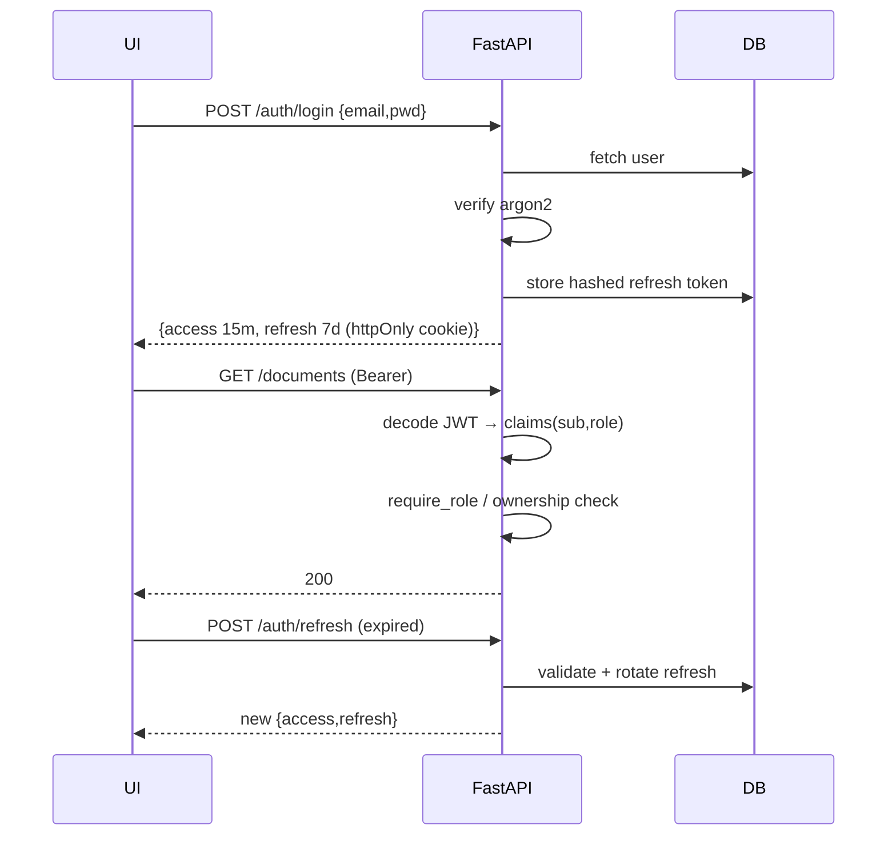

RBAC via FastAPI dependencies (`get_current_user` → `require_role(ADMIN)`); resource-ownership checks in services. Refresh tokens stored hashed, rotated per use, revoked on logout.

---

## 13. LangGraph State Diagram

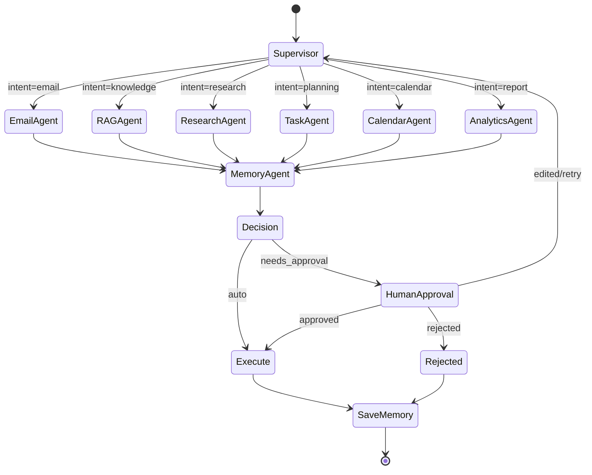

```python
class GraphState(TypedDict, total=False):
    run_id: str; user_id: str; request: str
    intent: str; selected_agents: list[str]
    retrieved_docs: list[Citation]; draft: dict
    needs_approval: bool
    approval_decision: Literal["pending","approved","rejected","edited"]
    result: dict; error: str | None
    messages: Annotated[list[BaseMessage], add_messages]
```

Compiled with a checkpointer keyed by `run_id`; `HumanApproval` uses `interrupt()` → durable pause/resume (§20).

---

## 14. Multi-Agent Architecture

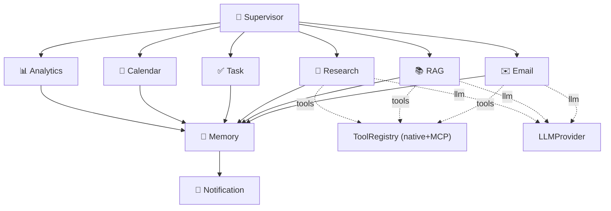

Each agent = single-responsibility LangGraph node (state→state), DI'd, event-aware, prompt-registry driven, auto-registered. Structured outputs via `LLMProvider.structured(schema)`.

---

## 15. Agent Communication Flow

Agents never call each other directly. They coordinate through **shared graph state** (supervisor-routed) and **domain events** (bus). This keeps them decoupled and the flow inspectable/auditable.

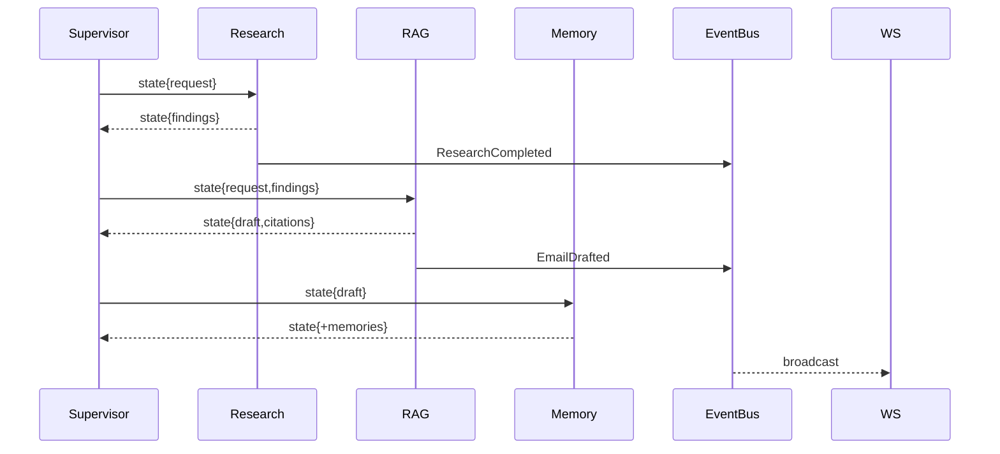

The `messages` channel uses the `add_messages` reducer (append-only) — no lost context, no races on shared keys.

---

## 16. Memory Architecture (Six Levels)

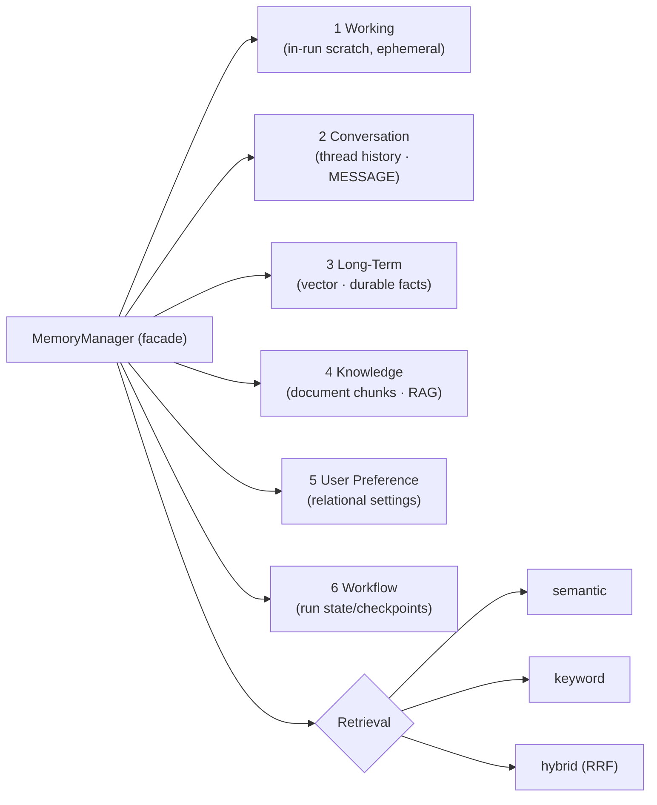

| Level | Store | Lifespan | Use |
|---|---|---|---|
| Working | in-process/state | single run | intermediate reasoning |
| Conversation | SQL `MESSAGE` | per thread | dialogue continuity |
| Long-term | vector (`MEMORY_ENTRY`) | durable | learned facts, past outcomes |
| Knowledge | vector (`DOCUMENT_CHUNK`) | durable | company documents (RAG) |
| Preference | SQL `USER_PREFERENCE` | durable | personalization |
| Workflow | checkpointer | per run, resumable | pause/resume, rollback |

Single `MemoryManager` facade (DRY); agents depend on it, not stores. Per-user partitioning + context compression (summarize old turns when window exceeded). `MemoryWritten` events feed analytics.

---

## 17. RAG Architecture (Full Pipeline)

Upgraded to the full enterprise pipeline.

```mermaid
flowchart TB
    subgraph Ingest["Ingestion (async, event-driven)"]
        UP[Upload] --> OCRs["OCR (scanned → text)"]
        OCRs --> CLN[Cleaning/normalize]
        CLN --> MDX[Metadata extraction]
        MDX --> CH["Chunking (token-aware, overlap)"]
        CH --> EMB[Embedding]
        EMB --> IDX["Index → VectorStore + metadata"]
        IDX --> EV[[emit DocumentIndexed]]
    end
    subgraph Query["Query time"]
        Q[Question] --> HS["Hybrid search (vector+keyword)"]
        HS --> RR[Reranking]
        RR --> CMP["Context compression (token budget)"]
        CMP --> GEN["LLM generate (+cite instructions)"]
        GEN --> CITE["Citations (chunk→doc,page)"]
        CITE --> MEMW["Write to Memory (levels 2/3)"]
    end
```

Stages: **OCR → Cleaning → Metadata → Chunking → Embedding → Hybrid Search → Reranking → Compression → Citation → Memory.** Each stage is a swappable component (provider/plugin); ingestion runs as a background task and emits events; retrieval scoped by `user_id` + metadata filters. RAG invoked only when the supervisor deems it relevant.

---

## 18. Prompt Management

Prompts are treated as software artifacts.

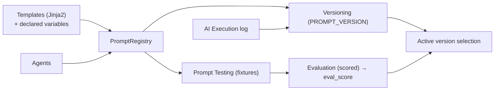

- **Registry** loads templates by `key`, resolves the active version, renders with validated variables.
- **Versioning:** every prompt has numbered versions in `PROMPT_VERSION`; each `AI_EXECUTION` records the exact prompt version used (reproducibility).
- **Testing & evaluation:** fixture inputs → expected-property checks / LLM-judge scoring → `eval_score`; promote best version to active. Exposed via `/prompts` API + Prompts page.

---

## 19. AI Tool Marketplace

Every tool — native or MCP — carries metadata and self-registers.

```python
@register_tool
class VectorSearchTool(Tool):
    meta = ToolMeta(
        name="vector_search", description="Semantic search over indexed docs",
        category="retrieval", permissions=["documents:read"],
        inputs=VectorSearchIn, outputs=VectorSearchOut,
        dependencies=["VectorStoreProvider","EmbeddingProvider"],
        version="1.0.0", origin="native")
    async def run(self, args: VectorSearchIn) -> VectorSearchOut: ...
```

`ToolMeta` = **Name, Description, Category, Permissions, Inputs, Outputs, Dependencies, Version** (+ `origin` native/mcp). The `ToolRegistry` auto-collects all tools (including MCP adapters, §8); the Marketplace UI lists/filters them; the supervisor selects tools dynamically by category/permission; permissions are enforced against the caller's role before execution.

---

## 20. Workflow Versioning & Lifecycle

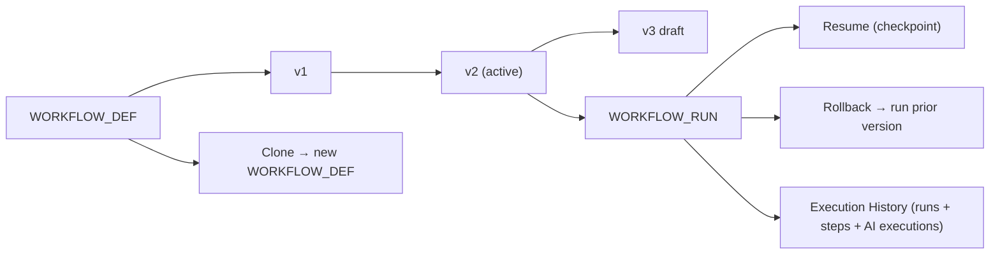

Capabilities: **Version** (immutable `graph_spec` per version), **Execution History** (all runs with full traces), **Rollback** (activate/execute a previous version), **Resume** (from checkpoint after failure/approval), **Checkpoint** (durable state via checkpointer), **Clone** (fork a definition). Runs always pin a `workflow_version_id` so history is reproducible.

---

## 21. Workflow Execution Flow

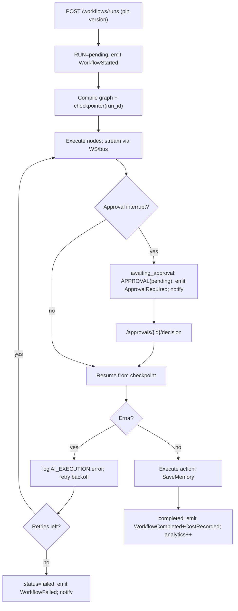

Every node writes `WORKFLOW_STEP` + `AI_EXECUTION` (+ `TOOL_CALL`) — the data behind observability, cost, and the Workflow Builder visualization.

---

## 22. AI Observability & Cost Dashboard

**Every AI execution records:** prompt, prompt version, model, provider, prompt/completion tokens, **cost (USD, computed per provider price table)**, execution time, retrieved documents, agent name, workflow/run id, user id, tool calls, errors — persisted to `AI_EXECUTION` + `TOOL_CALL`.

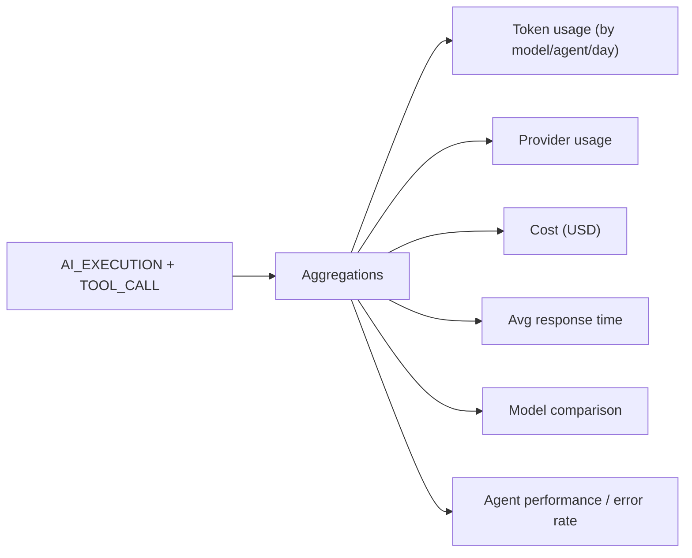

Ollama cost = 0 by default; a configurable **price table** per provider/model makes the cost dashboard correct the moment a paid provider is enabled — no code change. Powers the **AI Monitoring** and **Cost** dashboard pages. `CostRecorded` events update analytics live.

---

## 23. Sequence Diagrams

All diagrams are authored as `.mmd` under `docs/diagrams/` and exported to PNG + SVG (Appendix B). The eight required flows:

### 23.1 Login
```mermaid
sequenceDiagram
    participant U as UI
    participant A as Auth API
    participant DB
    U->>A: POST /auth/login
    A->>DB: fetch user; verify argon2
    A->>DB: store hashed refresh
    A-->>U: access+refresh
```
### 23.2 Upload Document
```mermaid
sequenceDiagram
    participant U as UI
    participant D as documents.router
    participant S as StorageProvider
    participant BG as BackgroundTask
    participant P as RAG pipeline
    participant V as VectorStore
    U->>D: POST /documents (file)
    D->>S: save file; DOCUMENT(uploaded)
    D->>BG: schedule ingest
    D-->>U: 202 processing
    BG->>P: OCR→clean→meta→chunk→embed
    P->>V: upsert vectors
    P->>D: status=indexed; emit DocumentIndexed → WS
```
### 23.3 RAG Query
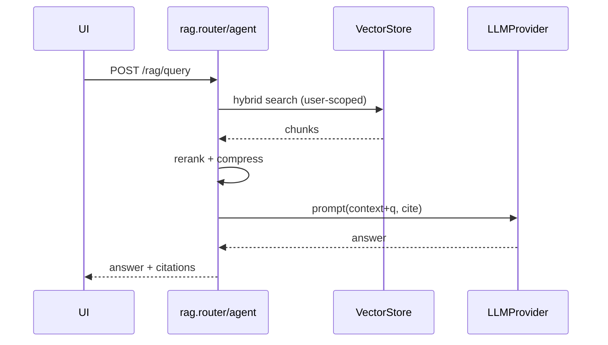
### 23.4 Email Automation
```mermaid
sequenceDiagram
    participant U as UI
    participant W as Email workflow
    participant E as EmailAgent
    participant AP as ApprovalGate
    participant M as EmailProvider(SMTP)
    U->>W: POST /emails/{id}/draft
    W->>E: analyze→retrieve→draft
    E-->>W: EmailDraft; emit EmailDrafted
    W->>AP: interrupt(needs_approval); emit ApprovalRequired
    U->>W: approve
    W->>M: send; EMAIL.status=sent; emit WorkflowCompleted
```
### 23.5 Research Workflow
```mermaid
sequenceDiagram
    participant U as UI
    participant S as Supervisor
    participant R as ResearchAgent
    participant SE as SearchProvider
    U->>S: POST /research/report
    S->>R: run
    loop per source
        R->>SE: search + fetch (Playwright)
        SE-->>R: content
    end
    R->>R: summarize + compare
    R-->>U: report; emit ResearchCompleted
```
### 23.6 Approval Workflow
```mermaid
sequenceDiagram
    participant W as Workflow
    participant DB
    participant N as NotificationProvider
    participant U as User
    W->>DB: APPROVAL(pending); emit ApprovalRequired
    W->>N: notify (Telegram/email)
    U->>W: POST /approvals/{id}/decision {approve|reject|edit|retry}
    W->>DB: record decision + decider
    W->>W: resume(checkpoint) or terminate; emit ApprovalReceived
```
### 23.7 Scheduler
```mermaid
sequenceDiagram
    participant SC as APScheduler
    participant WF as Workflow engine
    participant N as Notification
    SC->>WF: trigger job (cron) e.g. inbox digest
    WF->>WF: run graph
    WF->>N: notify daily summary; emit WorkflowCompleted
```
### 23.8 Notifications
```mermaid
sequenceDiagram
    participant B as EventBus
    participant H as Notification handler
    participant P as NotificationProvider
    participant U as User/UI
    B-->>H: NotificationRequested / ApprovalRequired / WorkflowFailed
    H->>P: dispatch (channel from prefs)
    P-->>U: Telegram / Email / in-app (WS)
```

---

## 24. Component Diagrams

### 24.1 Backend containers
```mermaid
flowchart TB
    subgraph FastAPI
        MW[Middleware: cid·rate-limit·errors] --> RT[Routers /api/v1]
        WSG[WebSocket manager]
    end
    subgraph Platform
        REG[Registries+Factory]; BUS[EventBus]; OBS[Observability/Cost]; PR[PromptRegistry]
    end
    subgraph Domain
        SVCS[Services]; AGS[Agents+Graph]; IF[Interfaces]
    end
    subgraph Infra
        REPO[Repositories]; PROV[10 Providers]; MCPL[MCP layer]; SCH[APScheduler]
    end
    RT-->SVCS-->REPO; SVCS-->AGS-->IF; IF<-- impl ---PROV
    AGS-->PR; AGS-->OBS; SVCS-->BUS; WSG<-->BUS; SVCS-->REG; AGS-->MCPL
```
### 24.2 Frontend
```mermaid
flowchart TB
    L[RootLayout+Providers: Theme·Query·Auth·WS] --> DASH["(dashboard) segment"]
    DASH --> FEAT[features/*] --> COMMON[common/] --> PRIM[ui/ shadcn]
    FEAT --> RQ[TanStack Query] --> APIC[lib/api]
    FEAT --> Z[Zustand]; FEAT --> WSC[lib/ws]
```

---

## 25. Deployment Architecture

```mermaid
flowchart TB
    subgraph Host["Docker host (dev & small prod)"]
        NGINX[nginx TLS/routing] --> FE[frontend:3000]
        NGINX --> BE[backend:8000]
        BE --> OLL[ollama:11434]
        BE --> CH[chromadb]
        BE --> VOL[(volumes: documents · vector_store · sqlite · logs · ollama_models)]
    end
```

Scale path (documented, not built now): SQLite→Postgres, add Redis (cache + rate-limit + event bus + Celery/RQ), multiple stateless backend replicas, Ollama on GPU node or hosted LLM via `LLMProvider` — config changes, not rewrites (§32).

---

## 26. Docker Architecture

| Service | Build/Image | Port | Volumes | Notes |
|---|---|---|---|---|
| backend | `./backend` | 8000 | documents, vector_store, sqlite, logs | uvicorn; waits on healthy ollama/chroma |
| frontend | `./frontend` | 3000 | — | Next.js standalone |
| ollama | `ollama/ollama` | 11434 | ollama_models | init pulls `llama3` + `nomic-embed-text` |
| chromadb | `chromadb/chroma` | 8001 | vector_store | persistent |
| proxy (prod) | `nginx` | 80/443 | certs | TLS + routing |

Multi-stage Dockerfiles, non-root user, `.dockerignore`, healthchecks + `depends_on: service_healthy`, env-injected config, one-command `docker compose up`.

---

## 27. Security Design

| Threat | Control |
|---|---|
| Credential theft | argon2id hashing; never log/return plaintext |
| Session hijack | access JWT 15m + rotating refresh (httpOnly·Secure·SameSite=Strict) |
| Broken access control | RBAC deps + per-resource ownership checks |
| SQLi | parameterized SQLAlchemy only |
| XSS | React escaping + CSP |
| CSRF | Bearer for state changes; SameSite; token if cookie-auth |
| Malicious uploads | MIME+magic-byte+size validation; store outside webroot; random names; never execute |
| Secret leakage | `.env` only; redacted logs; `.env` git-ignored |
| Abuse/DoS | per-user/IP rate limit; size limits; LLM/web timeouts |
| Prompt injection (docs/web/email/**MCP tools**) | treat all retrieved/tool content as untrusted data; HITL before outbound/irreversible; tool permission allow-lists (§19) |
| SSRF (research/MCP fetch) | URL allow/deny; block private IP ranges; timeouts |
| Malicious MCP server | explicit config allow-list; per-tool permissions; sandboxed transport |
| Data privacy | per-user vector partitioning; local-only inference default |

Security headers via middleware; all inputs Pydantic-validated at the boundary.

---

## 28. Logging & Monitoring Strategy

Structured JSON logs (`timestamp, level, logger, correlation_id, user_id, event, duration_ms, …`, redacted secrets); correlation IDs thread request→service→agent→`AI_EXECUTION`; `/metrics` (Prometheus: request/latency/errors, LLM tokens, cost, queue depth, ingestion throughput); `/health` readiness checks DB+Chroma+Ollama+MCP; container stdout → ELK/Loki-ready.

---

## 29. Error Handling Strategy

```mermaid
flowchart LR
    E[Error] --> T{Type}
    T -->|DomainError| H1[4xx envelope]
    T -->|ValidationError| H2[422 + fields]
    T -->|AuthError| H3[401/403]
    T -->|ProviderError| H4[retry/backoff → fallback → 503]
    T -->|Unexpected| H5[500 generic + log stack + cid]
```

Exception hierarchy (`AppError` base); central handler maps to the envelope (routers stay clean); external calls wrapped with timeouts + bounded retries (backoff+jitter) + circuit-breaker fallback; workflow-level resume via checkpointer; user errors never leak stack/secrets and carry a `correlation_id`; graceful degradation on provider outage.

---

## 30. Testing Strategy

| Level | Scope | Tooling | Gate |
|---|---|---|---|
| Unit | services, agents (mock LLM/repos), chunking, registries, event bus | pytest, pytest-asyncio, mock | ≥80% domain/services |
| Integration | routers vs test DB + fake providers | httpx AsyncClient, txn rollback | all routers |
| Agent/workflow | graphs with deterministic mock `LLMProvider` | pytest | key workflows |
| Prompt eval | fixture-based scoring | custom harness (§18) | on prompt change |
| Frontend | components + hooks | Vitest + RTL | critical components |
| E2E smoke | login→upload→query | Playwright | pre-release |

DIP seams enable clean mocking of Ollama/Chroma/web/SMTP/Telegram/MCP; CI runs ruff+mypy+pytest / eslint+tsc; deterministic (no live network, fixed seeds/clock).

---

## 31. Documentation Plan

Delivered under `docs/` (generated/maintained alongside code):

| Doc | Contents |
|---|---|
| `README.md` | Overview, features, quickstart, screenshots, one-command run |
| `ARCHITECTURE.md` | This document |
| `guides/api-guide.md` | Endpoints, envelope, auth, examples (+ OpenAPI link) |
| `guides/development-guide.md` | Local setup, conventions, layering rules, DI |
| `guides/deployment-guide.md` | Docker/Compose, env, prod profile, scaling |
| `guides/testing-guide.md` | Running/writing tests, mocks, coverage |
| `guides/agent-development-guide.md` | Build a new agent (contract, prompts, registration) |
| `guides/plugin-development-guide.md` | Add providers/tools/workflows via registry |
| `guides/mcp-integration-guide.md` | Configure MCP clients/servers, expose/consume tools |

---

## 32. Future Scalability Plan

Every step is enabled by an existing seam — no rewrite:
1. SQLite→Postgres (async driver ready; connection string + migration).
2. In-proc EventBus→Redis pub/sub (same interface).
3. BackgroundTasks/APScheduler→Celery/RQ on Redis.
4. ChromaDB→Qdrant/pgvector behind `VectorStoreProvider`.
5. Ollama→GPU/hosted via `LLMProvider`.
6. N stateless backend replicas behind proxy (JWT + WS via shared pub/sub).
7. Multi-tenancy via tenant_id partitioning.
8. OpenTelemetry traces + Grafana dashboards.
9. Third-party plugins via entry-points (no core edits).

---

## 33. Development Roadmap (Milestones)

Full scope retained. Each milestone ends with working, tested, integrated code (no placeholders) + summary + next step.

| Milestone | Phase | Deliverables | Exit |
|---|---|---|---|
| **M0** | — | This blueprint | ✅ Approved v2.0 |
| **M1 Foundation** | 1 | Monorepo; backend app factory + `core/` (config, logging, security, container, errors, middleware); **plugin registry + event bus skeleton**; DB session + Alembic baseline; auth+users (JWT+RBAC); Next.js skeleton (theme/dark, auth, dashboard shell); Docker Compose (backend, frontend, ollama, chroma); `/health`; CI | `compose up` runs; register/login; protected route; tests green |
| **M2 Documents & RAG** | 2 | Providers (storage/OCR/embedding/vectorstore); full RAG pipeline (OCR→…→citation→memory); documents feature; chat + RAG UI | upload→indexed→cited answer e2e |
| **M3 Agents & Orchestration** | 3 | LLMProvider/Ollama; LangGraph state+supervisor+checkpointer; Email/Research/Memory/Task/Calendar agents; ToolRegistry+marketplace; **MCP layer**; prompt registry; 6-level memory | multi-agent run; email draft; research report; MCP tool callable |
| **M4 HITL, Automation & Ops** | 4 | Approval gate+UI; APScheduler; notifications (Telegram/SMTP); analytics + **cost/observability**; workflow versioning+lifecycle; WS live status | approval-gated send; scheduled digest; cost dashboard populated |
| **M5 Polish & Ship** | 5 | Workflow Builder viz; UI polish+a11y; full tests+E2E; **9 docs**; diagram exports (PNG/SVG); prod profile; demo | all FRs demoable; docs complete; prod compose up |

**M1 sub-steps (each reviewable, one at a time):**
1. **Repo scaffold + backend app factory + `core/config` + `core/logging` + `/health`.** ← *starting now*
2. Platform skeletons: plugin registry + factory + scanner; event bus (in-proc).
3. DB layer: base, async session, Alembic baseline, `User` model + migration.
4. `core/security` (argon2+JWT) + auth feature + tests.
5. Users feature + RBAC deps + admin listing + tests.
6. Frontend scaffold (Next.js+TS strict+Tailwind+shadcn+providers+dark mode).
7. Auth pages + API/WS client + auth store + dashboard shell + nav.
8. Docker Compose (backend, frontend, ollama, chroma) + `.env.example` + README quickstart + CI.

---

## Appendix A — Technology Decisions Ledger

| Concern | Chosen | Alternatives | Why |
|---|---|---|---|
| Orchestration | LangGraph | raw LangChain, custom FSM | cyclic graphs, checkpointing, HITL, versioning |
| Extensibility | registry+factory+entry-points | hardcoded wiring | Open/Closed; zero-edit plugins |
| Comms | async EventBus (→Redis) | direct calls | decoupling; future integrations |
| Tool protocol | MCP + native unified | native only | industry-standard interop |
| LLM/embeddings | Ollama (abstracted) | hosted-only | free/local; swappable |
| Vector DB | ChromaDB (abstracted) | Qdrant/FAISS/pgvector | spec; simple; swappable |
| RDBMS | SQLite→Postgres | Postgres-first | spec; async+Alembic keep migration trivial |
| ORM | SQLAlchemy 2.0 async | SQLModel/Tortoise | mature, async, Alembic |
| Auth | JWT access+refresh | sessions | stateless/scalable |
| FE state | TanStack Query+Zustand | Redux Toolkit | less boilerplate; clean separation |
| Scheduler | APScheduler | Celery beat | spec; lightweight; Celery=scale path |
| OCR | Tesseract (abstracted) | PaddleOCR/cloud | free/local; swappable |

## Appendix B — Diagram Export Strategy

- **Source of truth:** Mermaid `.mmd` files in `docs/diagrams/` (also embedded in this doc, GitHub-rendered).
- **Export:** `scripts/export-diagrams` runs `@mermaid-js/mermaid-cli` (Docker image `minlag/mermaid-cli`) to produce **PNG + SVG** into `docs/diagrams/exported/` for the README and offline/enterprise sharing.
- Formats delivered per diagram: **Mermaid (`.mmd`) + PNG + SVG**.

---

*End of blueprint v2.0. Proceeding to **M1 — Sub-step 1** below.*
